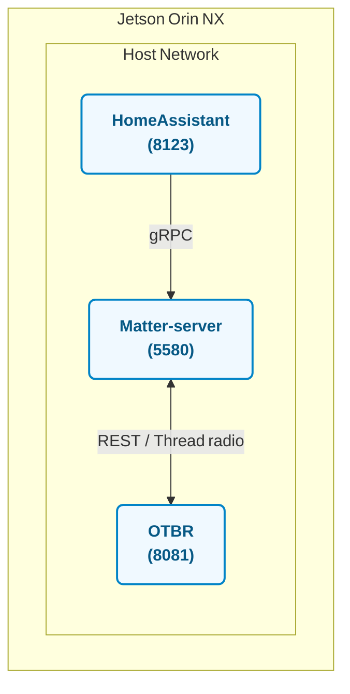

# MatterHub Platform

**HomeAssistant + Matter‑server + OTBR (IPv6 MRT6 Patch)**

---

## 📦 Overview

Jetson Orin NX 환경에서 **HomeAssistant**와 **Matter‑server**를 `docker‑compose` 한 번에 구동하고, **OpenThread Border Router (OTBR)** 소스를 **클론 → 패치 → 설치**까지 자동화하는 **원‑클릭 배포 스택**입니다.

---

## ⚡ Quick Start

```bash
git clone https://github.com/JayMon0327/matterhub-platform.git
cd matterhub-platform
sudo --preserve-env=HOME ./scripts/install.sh
```

> **Why `sudo --preserve-env=HOME`?**  OTBR setup 단계는 *root* 권한이 필요하지만 패치 경로(`~/matterhub-platform`)를 현재 사용자 `HOME` 그대로 사용하기 위해 환경 변수를 보존합니다.

---

## 🗺️ Architecture Diagram



> **요약**
>
> * **HomeAssistant** (8123) ⇒ UI & Automations
> * **Matter‑server** (5580) ⇐ gRPC from HomeAssistant / ⇔ OTBR
> * **OTBR** (8081 REST + Thread Radio)

---

## 📁 Repository Layout

```text
matterhub-platform/
├── docker-compose.yml     # HomeAssistant + Matter‑server (host network)
├── README.md
└── scripts/
    ├── install.sh         # clone · patch · setup + compose up -d
    └── patch_otbr.sh      # MulticastRoutingManager MRT6 workaround
```

---

## 🧩 Stack Components

| Service       | Container image (tag)                                     | Role                                 |
| ------------- | --------------------------------------------------------- | ------------------------------------ |
| HomeAssistant | `ghcr.io/home-assistant/home-assistant:stable`            | Smart‑home integration hub           |
| Matter‑server | `ghcr.io/home-assistant-libs/python-matter-server:stable` | Matter controller back‑end           |
| OTBR          | Upstream `ot-br-posix` + `scripts/patch_otbr.sh`          | Jetson MRT6 workaround border router |

---

## 🌐 Network & Ports

| Service            | Port / mode      | Notes                                      |
| ------------------ | ---------------- | ------------------------------------------ |
| HomeAssistant UI   | `8123` (host)    | Web UI                                     |
| Matter‑server gRPC | host network     | Invoked internally by HomeAssistant add‑on |
| OTBR REST API      | `8080` (default) | Can be changed in `./script/setup`         |

---

## 🚀 What `install.sh` Does

1. **Verify** Docker & *docker‑compose* availability
2. **Clone** `ot-br-posix` into `~/matterhubV1.0/ot-br-posix` and run `./script/bootstrap`
3. **Patch** with `patch_otbr.sh` (replaces `multicast_routing.cpp` to bypass MRT6)
4. **Setup** OTBR with `FIREWALL=0 INFRA_IF_NAME=wlan0 ./script/setup`
5. **Launch** services via `docker compose up -d` (pulls & starts HomeAssistant / Matter‑server)

---

## ❗ Notes

* 모든 서비스가 **host network** 모드로 실행되므로 Jetson 호스트에서 **8123** 포트 충돌 여부를 미리 확인하세요.
* OTBR 패치는 Jetson 커널에서 `CONFIG_IPV6_MROUTE` 미지원 시 발생하는 MRT6 오류를 우회합니다.
* 재현성을 높이려면 `docker-compose.yml`의 이미지 태그를 `stable` 대신 고정 버전(예: `2025.5.1`)으로 지정하는 것을 권장합니다.

